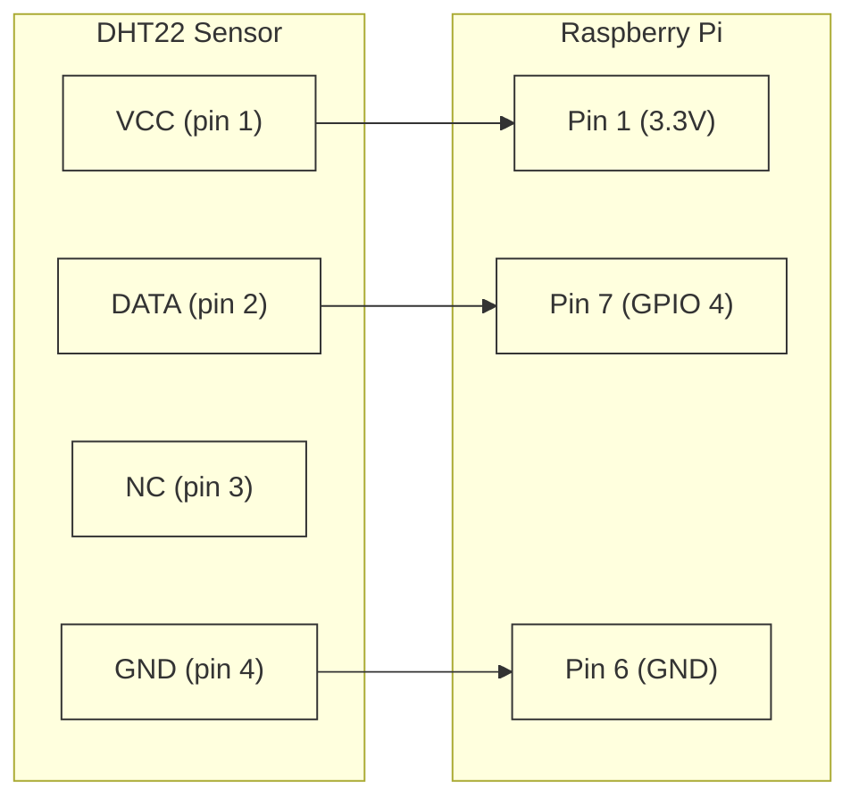

# [circuitpython] 📟


## Diagrams

### Pinout/Block

#### DHT22 Temperature Sensor

> Default GPIO pin configured in `src/temperature/temperature_driver.py:31`

## Running Integration Tests

Integration tests require real hardware and run on a remote Raspberry Pi via SSH using pytest-xdist.

### Setup Remote Device

1. Ensure your Raspberry Pi has Python 3 and pytest-xdist installed
2. Configure SSH access to your Pi (test with `ssh pi@raspberrypi.local`)
3. Set the `PI_HOST` environment variable:

```bash
export PI_HOST=pi@raspberrypi.local
# or use a specific IP
export PI_HOST=pi@192.168.1.100
```